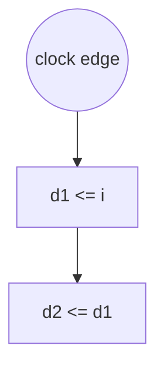

# Formal Verification Report: `async.v`

**Language:** Verilog  
**Source:** `async.v`

## Registers

| Name | Width | Array | Notes |
|------|-------|-------|-------|
| `d1` | [0:0] | - | NOT assigned at reset |
| `d2` | [0:0] | - | NOT assigned at reset |

## Continuous Assignments

| Target | Expression |
|--------|------------|
| `o` | `d2` |

## Issues

- 🟠 **WARNING:** No reset logic found (no if statement in always/process)

## Execution Path Diagram



## Source Code

```verilog


reg d1;
reg d2;

always @(posedge clk)
 d1 <= i;
 
always @(posedge clk)
  d2 <= d1;
  
assign o = d2;
```

---
*Generated by formal_verify.py*