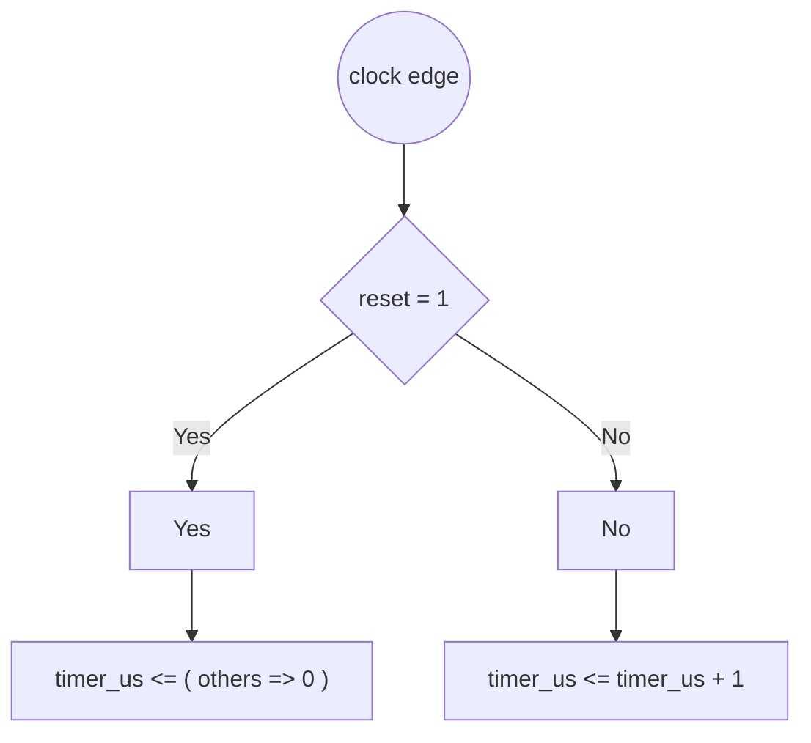
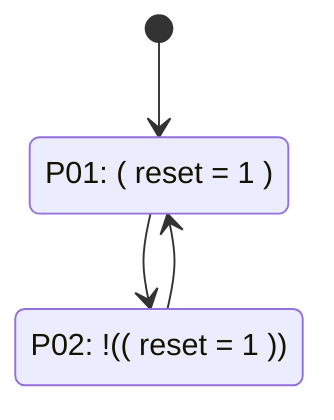

# Formal Verification Report: `counter.vhd`

**Language:** VHDL  
**Source:** `counter.vhd`

## Registers

| Name | Width | Array | Notes |
|------|-------|-------|-------|
| `timer_tick` | [0:0] | - | NOT assigned at reset |
| `timer_us` | [25:0] | - |  |

## Ports

| Direction | Name | Width |
|-----------|------|-------|
| ◀ Input | `clk` | 1 bit |
| ◀ Input | `reset` | 1 bit |

## Issues

- 🔴 **CRITICAL:** timer_tick NOT assigned at reset
- 🔴 **CRITICAL:** timer_tick is declared but NEVER assigned anywhere

## Execution Path Diagram



## State Machine Diagram



## Path Coverage Table

| Legend | Meaning |
|:-----:|---------|
| 🟢 **v** | assigned in this path |
| 🔵 **b** | not assigned here, but defined before (retains value) |
| 🔴 **x** | NEVER defined |

| Path | `timer_tick` | `timer_us` |
|------|:---:|:---:|
| P01 | 🔴 **x** | 🟢 **v** |
| P02 | 🔴 **x** | 🟢 **v** |

## Path Descriptions

**P01:** `( reset = '1' )`
  - Retains: `timer_tick`

**P02:** `!(( reset = '1' )) -> else`
  - Retains: `timer_tick`

## Source Code

```vhdl
library IEEE;
use IEEE.STD_LOGIC_1164.ALL;
use IEEE.NUMERIC_STD.ALL;

entity counter is
    port (
        clk   : in STD_LOGIC;
        reset : in STD_LOGIC
    );
end entity;

architecture rtl of counter is
    signal timer_us   : UNSIGNED(25 downto 0) := (others => '0');
    signal timer_tick : STD_LOGIC;
begin
    process(clk)
    begin
        if rising_edge(clk) then
            if (reset = '1') then
                timer_us <= (others => '0');
            else
                timer_us <= timer_us + 1;
            end if;
        end if;
    end process;
end architecture;
```

---
*Generated by formal_verify.py*