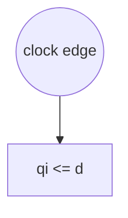

# Formal Verification Report: `en_but_en_key.v`

**Language:** Verilog  
**Source:** `en_but_en_key.v`

## Wires

| Name | Width | Driver Expression |
|------|-------|-------------------|
| `w0` | [-7:0] | `va4102a` |
| `w1` | [0:0] | *undriven* |
| `w2` | [0:0] | *undriven* |
| `w3` | [0:0] | `vf54559` |
| `w4` | [0:0] | *undriven* |
| `w5` | [0:0] | `v2bc900` |
| `w6` | [0:0] | `w5` |

## Continuous Assignments

| Target | Expression |
|--------|------------|
| `w0` | `v8d8391` |
| `vfe1227` | `w2` |
| `v2c3842` | `w4` |
| `w5` | `v2bc900` |
| `w6` | `v2bc900` |
| `w6` | `w5` |
| `w0` | `va4102a` |
| `ve8318d` | `w1` |
| `w3` | `vf54559` |
| `q` | `qi` |
| `en_led` | `config_reg[0] &! config_reg[1]` |
| `en_but` | `config_reg[1] &! config_reg[0]` |

## Ports

| Direction | Name | Width |
|-----------|------|-------|
| ◀ Input | `clk` | 1 bit |
| ◀ Input | `config_reg` | [7:0] |
| ◀ Input | `d` | 1 bit |
| ▶ Output | `en_but` | 1 bit |
| ▶ Output | `en_led` | 1 bit |
| ▶ Output | `q` | 1 bit |
| ◀ Input | `v2bc900` | 1 bit |
| ▶ Output | `v2c3842` | 1 bit |
| ◀ Input | `v8d8391` | [7:0] |
| ◀ Input | `va4102a` | 1 bit |
| ▶ Output | `va58c5b` | 1 bit |
| ▶ Output | `ve8318d` | 1 bit |
| ◀ Input | `vf54559` | 1 bit |
| ▶ Output | `vfe1227` | 1 bit |

## Issues

- 🟠 **WARNING:** No reset logic found (no if statement in always/process)

## Execution Path Diagram



## Source Code

```verilog
// Code generated by Icestudio 0.12
// Mon, 16 Feb 2026 13:25:00 GMT

`default_nettype none

//---- Top entity
module main (
 input v2bc900,
 input [7:0] v8d8391,
 output vfe1227,
 output v2c3842
);
 wire [0:7] w0;
 wire w1;
 wire w2;
 wire w3;
 wire w4;
 wire w5;
 wire w6;
 assign w0 = v8d8391;
 assign vfe1227 = w2;
 assign v2c3842 = w4;
 assign w5 = v2bc900;
 assign w6 = v2bc900;
 assign w6 = w5;
 main_v1f17c3 v1f17c3 (
  .config_reg(w0),
  .en_led(w1),
  .en_but(w3)
 );
 v58ed2b vae6662 (
  .vf54559(w1),
  .ve8318d(w2),
  .va4102a(w5)
 );
 v58ed2b v4fb1e0 (
  .vf54559(w3),
  .ve8318d(w4),
  .va4102a(w6)
 );
endmodule

//---- Top entity
module v58ed2b #(
 parameter v71e305 = 0
) (
 input va4102a,
 input vf54559,
 output va58c5b,
 output ve8318d
);
 localparam p2 = v71e305;
 wire w0;
 wire w1;
 wire w3;
 assign w0 = va4102a;
 assign ve8318d = w1;
 assign w3 = vf54559;
 v58ed2b_vb8adf8 #(
  .INI(p2)
 ) vb8adf8 (
  .clk(w0),
  .q(w1),
  .d(w3)
 );
endmodule

//---------------------------------------------------
//-- sys-DFF-verilog
//-- - - - - - - - - - - - - - - - - - - - - - - - --
//-- System - D Flip-flop. Capture data every system clock cycle. Verilog implementation
//---------------------------------------------------

module v58ed2b_vb8adf8 #(
 parameter INI = 0
) (
 input clk,
 input d,
 output q
);
 //-- Initial value
 reg qi = INI;
 
 //-- Capture the input data  
 //-- on the rising edge of  
 //-- the system clock
 always @(posedge clk)
   qi <= d;
   
 //-- Connect the register with the
 //-- output
 assign q = qi;
endmodule

module main_v1f17c3 (
 input [7:0] config_reg,
 output en_led,
 output en_but
);
 assign en_led = config_reg[0] &! config_reg[1];
 assign en_but = config_reg[1] &! config_reg[0];
endmodule
```

---
*Generated by formal_verify.py*