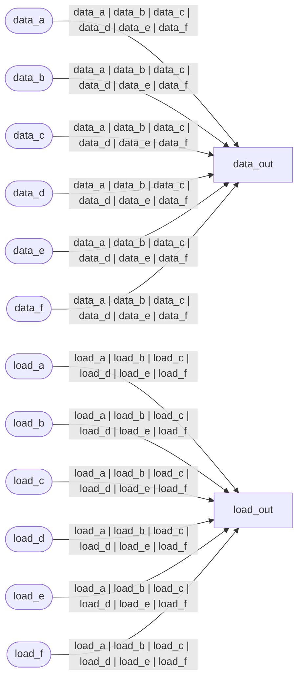

# Formal Verification Report: `or_wire.v`

**Language:** Verilog  
**Source:** `or_wire.v`

## Continuous Assignments

| Target | Expression |
|--------|------------|
| `load_out` | `load_a | load_b | load_c | load_d | load_e | load_f` |
| `data_out` | `data_a | data_b | data_c | data_d | data_e | data_f` |

## Issues

- 🔵 **INFO:** Combinatorial logic only (no clocked process)

## Dataflow Diagram



## Source Code

```verilog

assign load_out = load_a | load_b | load_c | load_d | load_e | load_f;
assign data_out = data_a | data_b | data_c | data_d | data_e | data_f;
```

---
*Generated by formal_verify.py*