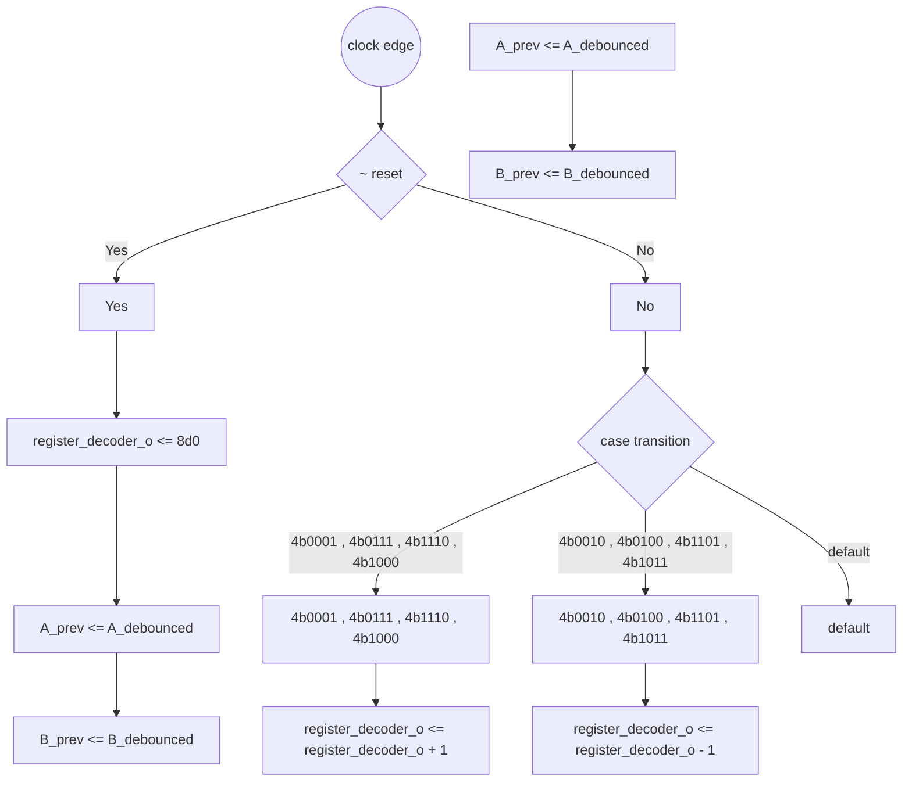
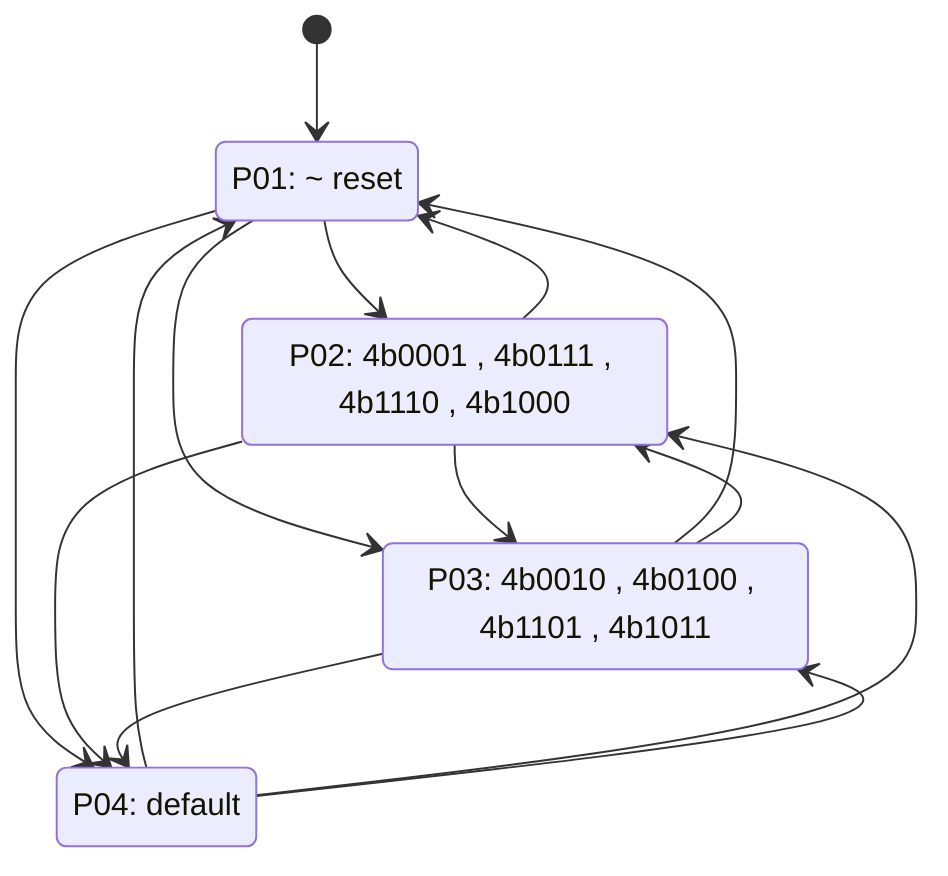

# Formal Verification Report: `rotory_encoder.v`

**Language:** Verilog  
**Source:** `rotory_encoder.v`

## Registers

| Name | Width | Array | Notes |
|------|-------|-------|-------|
| `A_prev` | [0:0] | - |  |
| `B_prev` | [0:0] | - |  |
| `register_decoder_o` | [7:0] | - |  |

## Wires

| Name | Width | Driver Expression |
|------|-------|-------------------|
| `curr_state` | [1:0] | `{A_debounced, B_debounced}` |
| `prev_state` | [1:0] | `{A_prev, B_prev}` |
| `transition` | [3:0] | `{prev_state, curr_state}` |

## Continuous Assignments

| Target | Expression |
|--------|------------|
| `register_decoder` | `register_decoder_o` |

## Issues

- 🟢 **OK:** All registers assigned at reset

## Execution Path Diagram



## State Machine Diagram



## Path Coverage Table

| Legend | Meaning |
|:-----:|---------|
| 🟢 **v** | assigned in this path |
| 🔵 **b** | not assigned here, but defined before (retains value) |
| 🔴 **x** | NEVER defined |

| Path | `A_prev` | `B_prev` | `register_decoder_o` |
|------|:---:|:---:|:---:|
| P01 | 🟢 **v** | 🟢 **v** | 🟢 **v** |
| P02 | 🟢 **v** | 🟢 **v** | 🟢 **v** |
| P03 | 🟢 **v** | 🟢 **v** | 🟢 **v** |
| P04 | 🟢 **v** | 🟢 **v** | 🔵 **b** |

## Path Descriptions

**P01:** `~ reset`
  - All registers assigned

**P02:** `!(~ reset) -> else -> transition==4'b0001 , 4'b0111 , 4'b1110 , 4'b1000`
  - All registers assigned

**P03:** `!(~ reset) -> else -> transition==4'b0010 , 4'b0100 , 4'b1101 , 4'b1011`
  - All registers assigned

**P04:** `!(~ reset) -> else -> transition==default`
  - Retains: `register_decoder_o`

## Source Code

```verilog
// Previous state of A and B
reg A_prev, B_prev;
// output register
reg [7:0]register_decoder_o;
assign  register_decoder = register_decoder_o;

// Combine previous and current state into 4-bit value for direction detection
wire [1:0] prev_state = {A_prev, B_prev};
wire [1:0] curr_state = {A_debounced, B_debounced};
wire [3:0] transition = {prev_state, curr_state};

always @(posedge clk) begin
    if (~reset) begin
        register_decoder_o <= 8'd0;
        A_prev <= A_debounced;
        B_prev <= B_debounced;
    end else begin
        case (transition)
            4'b0001, 4'b0111, 4'b1110, 4'b1000: register_decoder_o <= register_decoder_o + 1; // CW
            4'b0010, 4'b0100, 4'b1101, 4'b1011: register_decoder_o <= register_decoder_o - 1; // CCW
            default: ; // No change or invalid
        endcase

        // Update previous states
        A_prev <= A_debounced;
        B_prev <= B_debounced;
    end
end
```

---
*Generated by formal_verify.py*