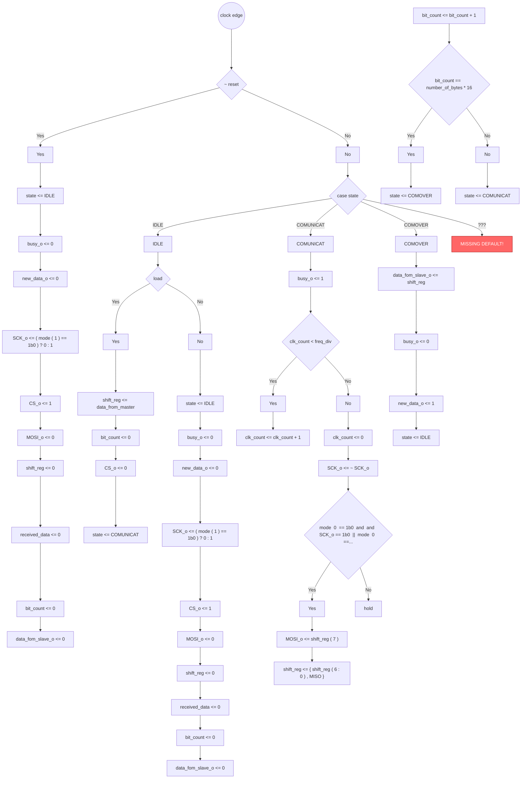
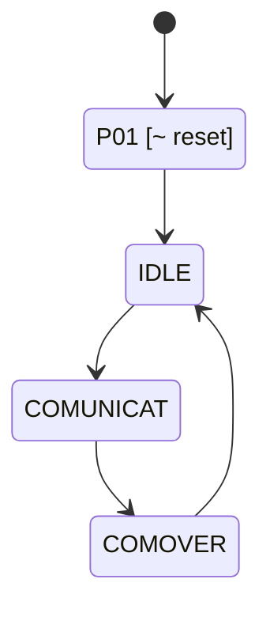

# Formal Verification Report: `spi.v`

**Language:** Verilog  
**Source:** `spi.v`

## Registers

| Name | Width | Array | Notes |
|------|-------|-------|-------|
| `CS_o` | [0:0] | - |  |
| `MOSI_o` | [0:0] | - |  |
| `SCK_o` | [0:0] | - |  |
| `bit_count` | [7:0] | - |  |
| `busy_o` | [0:0] | - |  |
| `clk_count` | [7:0] | - | NOT assigned at reset |
| `data_fom_slave_o` | [7:0] | - |  |
| `new_data_o` | [0:0] | - |  |
| `received_data` | [7:0] | - |  |
| `sck_toggle` | [0:0] | - | NOT assigned at reset |
| `shift_reg` | [7:0] | - |  |
| `shift_reg_form_slave` | [7:0] | - | NOT assigned at reset |
| `state` | [1:0] | - |  |

## Continuous Assignments

| Target | Expression |
|--------|------------|
| `busy` | `busy_o` |
| `new_data` | `new_data_o` |
| `SCK` | `SCK_o` |
| `CS` | `CS_o` |
| `MOSI` | `MOSI_o` |
| `data_from_slave` | `data_fom_slave_o` |

## State Encodings

| State | Value |
|-------|-------|
| `COMOVER` | `2'b10` |
| `COMUNICAT` | `2'b01` |
| `IDLE` | `2'b00` |

## Issues

- 🔴 **CRITICAL:** clk_count NOT assigned at reset
- 🔴 **CRITICAL:** sck_toggle NOT assigned at reset
- 🔴 **CRITICAL:** shift_reg_form_slave NOT assigned at reset
- 🔴 **CRITICAL:** No default case branch. Missing states: 2'b11
- 🔴 **CRITICAL:** sck_toggle is declared but NEVER assigned anywhere
- 🔴 **CRITICAL:** shift_reg_form_slave is declared but NEVER assigned anywhere

## Execution Path Diagram



## State Machine Diagram



## Path Coverage Table

| Legend | Meaning |
|:-----:|---------|
| 🟢 **v** | assigned in this path |
| 🔵 **b** | not assigned here, but defined before (retains value) |
| 🔴 **x** | NEVER defined |

| Path | `CS_o` | `MOSI_o` | `SCK_o` | `bit_count` | `busy_o` | `clk_count` | `data_fom_slave_o` | `new_data_o` | `received_data` | `sck_toggle` | `shift_reg` | `shift_reg_form_slave` | `state` |
|------|:---:|:---:|:---:|:---:|:---:|:---:|:---:|:---:|:---:|:---:|:---:|:---:|:---:|
| P01 | 🟢 **v** | 🟢 **v** | 🟢 **v** | 🟢 **v** | 🟢 **v** | 🔴 **x** | 🟢 **v** | 🟢 **v** | 🟢 **v** | 🔴 **x** | 🟢 **v** | 🔴 **x** | 🟢 **v** |
| P02 | 🟢 **v** | 🔵 **b** | 🔵 **b** | 🟢 **v** | 🔵 **b** | 🔴 **x** | 🔵 **b** | 🔵 **b** | 🔵 **b** | 🔴 **x** | 🟢 **v** | 🔴 **x** | 🟢 **v** |
| P03 | 🟢 **v** | 🟢 **v** | 🟢 **v** | 🟢 **v** | 🟢 **v** | 🔴 **x** | 🟢 **v** | 🟢 **v** | 🟢 **v** | 🔴 **x** | 🟢 **v** | 🔴 **x** | 🟢 **v** |
| P04 | 🔵 **b** | 🔵 **b** | 🔵 **b** | 🔵 **b** | 🟢 **v** | 🟢 **v** | 🔵 **b** | 🔵 **b** | 🔵 **b** | 🔴 **x** | 🔵 **b** | 🔴 **x** | 🔵 **b** |
| P05 | 🔵 **b** | 🟢 **v** | 🟢 **v** | 🟢 **v** | 🟢 **v** | 🟢 **v** | 🔵 **b** | 🔵 **b** | 🔵 **b** | 🔴 **x** | 🟢 **v** | 🔴 **x** | 🔵 **b** |
| P06 | 🔵 **b** | 🔵 **b** | 🟢 **v** | 🟢 **v** | 🟢 **v** | 🟢 **v** | 🔵 **b** | 🔵 **b** | 🔵 **b** | 🔴 **x** | 🔵 **b** | 🔴 **x** | 🔵 **b** |
| P07 | 🔵 **b** | 🔵 **b** | 🟢 **v** | 🟢 **v** | 🟢 **v** | 🟢 **v** | 🔵 **b** | 🔵 **b** | 🔵 **b** | 🔴 **x** | 🔵 **b** | 🔴 **x** | 🟢 **v** |
| P08 | 🔵 **b** | 🔵 **b** | 🟢 **v** | 🟢 **v** | 🟢 **v** | 🟢 **v** | 🔵 **b** | 🔵 **b** | 🔵 **b** | 🔴 **x** | 🔵 **b** | 🔴 **x** | 🟢 **v** |
| P09 | 🔵 **b** | 🔵 **b** | 🔵 **b** | 🔵 **b** | 🟢 **v** | 🔴 **x** | 🟢 **v** | 🟢 **v** | 🔵 **b** | 🔴 **x** | 🔵 **b** | 🔴 **x** | 🟢 **v** |

## Path Descriptions

**P01:** `~ reset`
  - Retains: `clk_count`, `sck_toggle`, `shift_reg_form_slave`

**P02:** `!(~ reset) -> else -> state==IDLE -> load`
  - Retains: `MOSI_o`, `SCK_o`, `busy_o`, `clk_count`, `data_fom_slave_o`, `new_data_o`, `received_data`, `sck_toggle`, `shift_reg_form_slave`

**P03:** `!(~ reset) -> else -> state==IDLE -> !(load)`
  - Retains: `clk_count`, `sck_toggle`, `shift_reg_form_slave`

**P04:** `!(~ reset) -> else -> state==COMUNICAT -> clk_count < freq_div`
  - Retains: `CS_o`, `MOSI_o`, `SCK_o`, `bit_count`, `data_fom_slave_o`, `new_data_o`, `received_data`, `sck_toggle`, `shift_reg`, `shift_reg_form_slave`, `state`

**P05:** `!(~ reset) -> else -> state==COMUNICAT -> !(clk_count < freq_div) -> ( mode [ 0 ] == 1'b0 && SCK_o == 1'b0 ) || ( mode [ 0 ] == 1'b1 && SCK_o == 1'b1 )`
  - Retains: `CS_o`, `data_fom_slave_o`, `new_data_o`, `received_data`, `sck_toggle`, `shift_reg_form_slave`, `state`

**P06:** `!(~ reset) -> else -> state==COMUNICAT -> !(clk_count < freq_div) -> !(( mode [ 0 ] == 1'b0 && SCK_o == 1'b0 ) || ( mode [ 0 ] == 1'b1 && SCK_o == 1'b1 )) [hold]`
  - Retains: `CS_o`, `MOSI_o`, `data_fom_slave_o`, `new_data_o`, `received_data`, `sck_toggle`, `shift_reg`, `shift_reg_form_slave`, `state`

**P07:** `!(~ reset) -> else -> state==COMUNICAT -> !(clk_count < freq_div) -> bit_count == ( number_of_bytes * 16 )`
  - Retains: `CS_o`, `MOSI_o`, `data_fom_slave_o`, `new_data_o`, `received_data`, `sck_toggle`, `shift_reg`, `shift_reg_form_slave`

**P08:** `!(~ reset) -> else -> state==COMUNICAT -> !(clk_count < freq_div) -> !(bit_count == ( number_of_bytes * 16 ))`
  - Retains: `CS_o`, `MOSI_o`, `data_fom_slave_o`, `new_data_o`, `received_data`, `sck_toggle`, `shift_reg`, `shift_reg_form_slave`

**P09:** `!(~ reset) -> else -> state==COMOVER`
  - Retains: `CS_o`, `MOSI_o`, `SCK_o`, `bit_count`, `clk_count`, `received_data`, `sck_toggle`, `shift_reg`, `shift_reg_form_slave`

## Source Code

```verilog
// states
parameter IDLE = 2'b00; 
parameter COMUNICAT = 2'b01;
parameter COMOVER = 2'b10;
//register
reg [7:0] shift_reg;
reg [7:0] shift_reg_form_slave;
reg [7:0] received_data;
reg [7:0] bit_count;
reg [7:0] clk_count;
reg sck_toggle;
reg [1:0]state;

//output register
reg busy_o;
assign busy = busy_o;
reg new_data_o;
assign new_data = new_data_o;
reg SCK_o;
assign SCK = SCK_o;
reg CS_o;
assign CS = CS_o;
reg MOSI_o;
assign MOSI = MOSI_o;
reg [7:0]data_fom_slave_o;
assign data_from_slave = data_fom_slave_o;

//main 
always @(posedge clk) begin
    if (~reset) begin
        state <= IDLE;
        busy_o <= 0;
        new_data_o <= 0;
        SCK_o <= (mode[1] == 1'b0) ? 0 : 1; // Set initial SCK based on mode
        CS_o <= 1;
        MOSI_o <= 0;
        shift_reg <= 0;
        received_data <= 0;
        bit_count <= 0;
        data_fom_slave_o <= 0;
    end else begin
        case (state)
        // wait for comunication
            IDLE: begin
                if (load) begin
                    shift_reg <= data_from_master;
                    bit_count <= 0;
                    CS_o <= 0;
                    state <= COMUNICAT;
                end else 
                begin // idle and reset reset all register
                    state <= IDLE;
                    busy_o <= 0;
                    new_data_o <= 0;
                    SCK_o <= (mode[1] == 1'b0) ? 0 : 1; // Set initial SCK based on mode
                    CS_o <= 1;
                    MOSI_o <= 0;
                    shift_reg <= 0;
                    received_data <= 0;
                    bit_count <= 0;
                    data_fom_slave_o <= 0;
                end
            end
        // comunicate
            COMUNICAT: 
            begin
                busy_o <= 1; // we are now busy
                if (clk_count < freq_div) // here we stay most of the time devide by 2 alwasy.
                begin
                    clk_count <= clk_count + 1;
                end else // run only if we reach freq_div
                begin
                    clk_count <= 0; 
                    
                    SCK_o <= ~SCK_o;
                    if ((mode[0] == 1'b0 && SCK_o == 1'b0) || (mode[0] == 1'b1 && SCK_o == 1'b1)) // handle rising or fallinf edge
                    begin
                        MOSI_o <= shift_reg[7];
                        shift_reg <= {shift_reg[6:0], MISO};
                    end

                    bit_count <= bit_count + 1; //counter to know when comuncation is over
                    if (bit_count == (number_of_bytes*16))
                        state <= COMOVER;
                    else 
                        state <= COMUNICAT;
                end
            end
            // finish comunication
            COMOVER: begin
                data_fom_slave_o <= shift_reg; //data to the output reg
                busy_o <= 0; // we are not busy anmore
                new_data_o <= 1; // there is new data
                state <= IDLE; //back to idle
            end
        endcase
    end
end
```

---
*Generated by formal_verify.py*