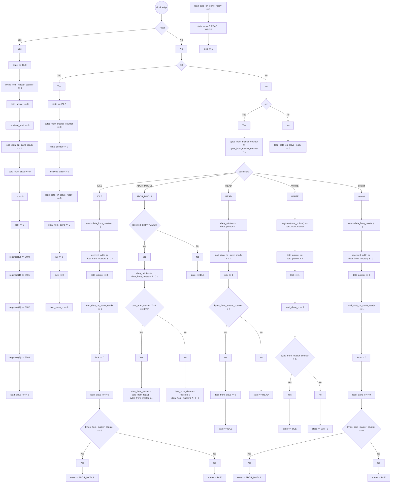
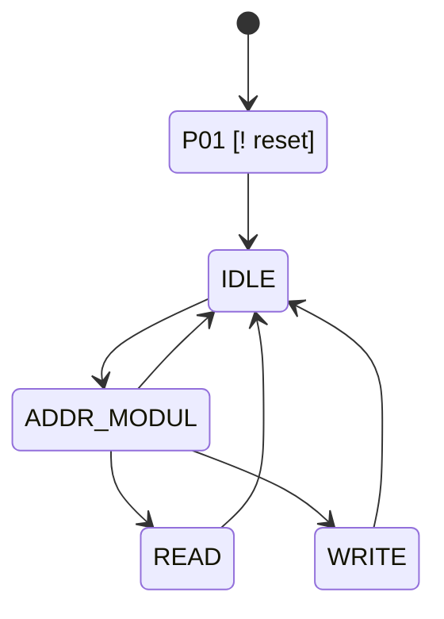

# Formal Verification Report: `spi_fsm.v`

**Language:** Verilog  
**Source:** `spi_fsm.v`

## Registers

| Name | Width | Array | Notes |
|------|-------|-------|-------|
| `bytes_from_master_counter` | [4:0] | - |  |
| `data_from_slave` | [7:0] | - |  |
| `data_pointer` | [7:0] | - |  |
| `load_data_on_slave_ready` | [0:0] | - |  |
| `load_slave_o` | [0:0] | - |  |
| `lock` | [0:0] | - |  |
| `received_addr` | [5:0] | - |  |
| `registers` | [7:0] | 4 elements |  |
| `rw` | [0:0] | - |  |
| `state` | [2:0] | - |  |

## Continuous Assignments

| Target | Expression |
|--------|------------|
| `lock_register` | `lock` |
| `load` | `load_data_on_slave_ready` |
| `load_slave` | `load_slave_o` |
| `data_out` | `data_from_slave` |
| `register_run` | `registers[1][0]` |
| `register_stop` | `registers[1][1]` |
| `register_mode` | `registers[1][3:2]` |
| `register_div` | `registers[2][7:0]` |
| `register_suport` | `registers[3][7:0]` |

## Ports

| Direction | Name | Width |
|-----------|------|-------|
| ◀ Input | `SS` | 1 bit |
| ◀ Input | `clk` | 1 bit |
| ◀ Input | `data_from_fpga` | [63:0] |
| ◀ Input | `data_from_master` | [7:0] |
| ▶ Output | `data_out` | [7:0] |
| ▶ Output | `load` | 1 bit |
| ▶ Output | `load_slave` | 1 bit |
| ▶ Output | `lock_register` | 1 bit |
| ◀ Input | `rcv` | 1 bit |
| ▶ Output | `register_0` | [7:0] |
| ▶ Output | `register_div` | [7:0] |
| ▶ Output | `register_mode` | [1:0] |
| ▶ Output | `register_run` | 1 bit |
| ▶ Output | `register_stop` | 1 bit |
| ▶ Output | `register_suport` | [7:0] |
| ◀ Input | `reset` | 1 bit |

## State Encodings

| State | Value |
|-------|-------|
| `ADDR_MODUL` | `3'b001` |
| `IDLE` | `3'b000` |
| `READ` | `3'b010` |
| `WRITE` | `3'b110` |

## Issues

- 🟢 **OK:** All registers assigned at reset

## Execution Path Diagram



## State Machine Diagram



## Path Coverage Table

| Legend | Meaning |
|:-----:|---------|
| 🟢 **v** | assigned in this path |
| 🔵 **b** | not assigned here, but defined before (retains value) |
| 🔴 **x** | NEVER defined |

| Path | `bytes_from_master_counter` | `data_from_slave` | `data_pointer` | `load_data_on_slave_ready` | `load_slave_o` | `lock` | `received_addr` | `registers` | `rw` | `state` |
|------|:---:|:---:|:---:|:---:|:---:|:---:|:---:|:---:|:---:|:---:|
| P01 | 🟢 **v** | 🟢 **v** | 🟢 **v** | 🟢 **v** | 🟢 **v** | 🟢 **v** | 🟢 **v** | 🟢 **v** | 🟢 **v** | 🟢 **v** |
| P02 | 🟢 **v** | 🟢 **v** | 🟢 **v** | 🟢 **v** | 🟢 **v** | 🟢 **v** | 🟢 **v** | 🔵 **b** | 🟢 **v** | 🟢 **v** |
| P03 | 🟢 **v** | 🔵 **b** | 🟢 **v** | 🟢 **v** | 🟢 **v** | 🟢 **v** | 🟢 **v** | 🔵 **b** | 🟢 **v** | 🟢 **v** |
| P04 | 🟢 **v** | 🔵 **b** | 🟢 **v** | 🟢 **v** | 🟢 **v** | 🟢 **v** | 🟢 **v** | 🔵 **b** | 🟢 **v** | 🟢 **v** |
| P05 | 🟢 **v** | 🟢 **v** | 🟢 **v** | 🟢 **v** | 🔵 **b** | 🟢 **v** | 🔵 **b** | 🔵 **b** | 🔵 **b** | 🟢 **v** |
| P06 | 🟢 **v** | 🟢 **v** | 🟢 **v** | 🟢 **v** | 🔵 **b** | 🟢 **v** | 🔵 **b** | 🔵 **b** | 🔵 **b** | 🟢 **v** |
| P07 | 🟢 **v** | 🔵 **b** | 🔵 **b** | 🔵 **b** | 🔵 **b** | 🔵 **b** | 🔵 **b** | 🔵 **b** | 🔵 **b** | 🟢 **v** |
| P08 | 🟢 **v** | 🟢 **v** | 🟢 **v** | 🟢 **v** | 🔵 **b** | 🟢 **v** | 🔵 **b** | 🔵 **b** | 🔵 **b** | 🟢 **v** |
| P09 | 🟢 **v** | 🔵 **b** | 🟢 **v** | 🟢 **v** | 🔵 **b** | 🟢 **v** | 🔵 **b** | 🔵 **b** | 🔵 **b** | 🟢 **v** |
| P10 | 🟢 **v** | 🔵 **b** | 🟢 **v** | 🔵 **b** | 🟢 **v** | 🟢 **v** | 🔵 **b** | 🟢 **v** | 🔵 **b** | 🟢 **v** |
| P11 | 🟢 **v** | 🔵 **b** | 🟢 **v** | 🔵 **b** | 🟢 **v** | 🟢 **v** | 🔵 **b** | 🟢 **v** | 🔵 **b** | 🟢 **v** |
| P12 | 🟢 **v** | 🔵 **b** | 🟢 **v** | 🟢 **v** | 🟢 **v** | 🟢 **v** | 🟢 **v** | 🔵 **b** | 🟢 **v** | 🟢 **v** |
| P13 | 🟢 **v** | 🔵 **b** | 🟢 **v** | 🟢 **v** | 🟢 **v** | 🟢 **v** | 🟢 **v** | 🔵 **b** | 🟢 **v** | 🟢 **v** |
| P14 | 🔵 **b** | 🔵 **b** | 🔵 **b** | 🟢 **v** | 🔵 **b** | 🔵 **b** | 🔵 **b** | 🔵 **b** | 🔵 **b** | 🔵 **b** |

## Path Descriptions

**P01:** `! reset`
  - All registers assigned

**P02:** `!(! reset) -> SS`
  - Retains: `registers`

**P03:** `!(! reset) -> !(SS) -> rcv -> state==IDLE -> bytes_from_master_counter == 0`
  - Retains: `data_from_slave`, `registers`

**P04:** `!(! reset) -> !(SS) -> rcv -> state==IDLE -> !(bytes_from_master_counter == 0)`
  - Retains: `data_from_slave`, `registers`

**P05:** `!(! reset) -> !(SS) -> rcv -> state==ADDR_MODUL -> received_addr == ADDR -> data_from_master [ 7 : 0 ] == 8'hFF`
  - Retains: `load_slave_o`, `received_addr`, `registers`, `rw`

**P06:** `!(! reset) -> !(SS) -> rcv -> state==ADDR_MODUL -> received_addr == ADDR -> !(data_from_master [ 7 : 0 ] == 8'hFF)`
  - Retains: `load_slave_o`, `received_addr`, `registers`, `rw`

**P07:** `!(! reset) -> !(SS) -> rcv -> state==ADDR_MODUL -> !(received_addr == ADDR)`
  - Retains: `data_from_slave`, `data_pointer`, `load_data_on_slave_ready`, `load_slave_o`, `lock`, `received_addr`, `registers`, `rw`

**P08:** `!(! reset) -> !(SS) -> rcv -> state==READ -> bytes_from_master_counter > 5`
  - Retains: `load_slave_o`, `received_addr`, `registers`, `rw`

**P09:** `!(! reset) -> !(SS) -> rcv -> state==READ -> !(bytes_from_master_counter > 5)`
  - Retains: `data_from_slave`, `load_slave_o`, `received_addr`, `registers`, `rw`

**P10:** `!(! reset) -> !(SS) -> rcv -> state==WRITE -> bytes_from_master_counter > 5`
  - Retains: `data_from_slave`, `load_data_on_slave_ready`, `received_addr`, `rw`

**P11:** `!(! reset) -> !(SS) -> rcv -> state==WRITE -> !(bytes_from_master_counter > 5)`
  - Retains: `data_from_slave`, `load_data_on_slave_ready`, `received_addr`, `rw`

**P12:** `!(! reset) -> !(SS) -> rcv -> state==default -> bytes_from_master_counter == 0`
  - Retains: `data_from_slave`, `registers`

**P13:** `!(! reset) -> !(SS) -> rcv -> state==default -> !(bytes_from_master_counter == 0)`
  - Retains: `data_from_slave`, `registers`

**P14:** `!(! reset) -> !(SS) -> !(rcv) -> else`
  - Retains: `bytes_from_master_counter`, `data_from_slave`, `data_pointer`, `load_slave_o`, `lock`, `received_addr`, `registers`, `rw`, `state`

## Source Code

```verilog
module spi_fsm #(parameter [5:0] ADDR = 6'd1) (
    input wire clk,
    input wire reset,
    input wire SS,
    input wire rcv,
    input wire [7:0] data_from_master,
    input wire [63:0] data_from_fpga,
    output wire lock_register,
    output wire load,
    output wire load_slave,
    output wire [7:0] data_out,
    output wire [7:0] register_0,
    output wire register_run,
    output wire register_stop,
    output wire [1:0] register_mode,
    output wire [7:0] register_div,
    output wire [7:0] register_suport
);

parameter IDLE          = 3'b000,
          ADDR_MODUL    = 3'b001,
          READ          = 3'b010,
          WRITE         = 3'b110;

reg [2:0]state;
reg [7:0]registers[3:0];
reg [4:0]bytes_from_master_counter;
reg [7:0]data_pointer;
reg rw;
reg lock;
assign lock_register = lock;
reg [5:0]received_addr;
reg load_data_on_slave_ready;
assign load = load_data_on_slave_ready;
reg [7:0]data_from_slave;
reg load_slave_o;
assign load_slave = load_slave_o;
assign data_out = data_from_slave;

assign register_0 = registers[1][4] ?
                    registers[0] :
                    { registers[0][0], registers[0][1], registers[0][2], registers[0][3],
                      registers[0][4], registers[0][5], registers[0][6], registers[0][7] };
assign register_run =    registers[1][0];
assign register_stop =   registers[1][1];
assign register_mode =   registers[1][3:2];
assign register_div =    registers[2][7:0];
assign register_suport = registers[3][7:0];


always @(posedge clk) begin
    if (!reset) begin
        state <= IDLE;
        bytes_from_master_counter <= 0;
        data_pointer <= 0;
        received_addr <= 0;
        load_data_on_slave_ready <= 0;
        data_from_slave <= 0;
        rw <= 0;
        lock <=0;
        registers[0]<=8'h00;
        registers[1]<=8'h01;
        registers[2]<=8'h02;
        registers[3]<=8'h03;
        load_slave_o <= 0;
    end else if (SS) begin
        state <= IDLE;
        bytes_from_master_counter <= 0;
        data_pointer <= 0;
        received_addr <= 0;
        load_data_on_slave_ready <= 0;
        data_from_slave <= 0;
        rw <= 0;
        lock <= 0;
        load_slave_o <= 0;
    end else if (rcv) begin
        bytes_from_master_counter <= bytes_from_master_counter + 1;

        case(state)

        IDLE:begin
            rw <= data_from_master[7];
            received_addr <= data_from_master[5:0];
            data_pointer <= 0;
            load_data_on_slave_ready <= 1;
            lock <= 0;
            load_slave_o <= 0;
            if (bytes_from_master_counter == 0)
                state <= ADDR_MODUL;
            else
                state <= IDLE;
        end

        ADDR_MODUL:begin
            if (received_addr == ADDR) begin
                data_pointer <= data_from_master[7:0];
                if (data_from_master[7:0] == 8'hFF)
                    data_from_slave <= data_from_fpga[(bytes_from_master_counter-1)*8 +: 8];
                else
                    data_from_slave <= registers[data_from_master[7:0]];
                load_data_on_slave_ready <= 1;
                state <= rw ? READ : WRITE;
                lock <= 1;
            end
            else
                state <= IDLE;
        end

        READ:begin
            data_pointer <= data_pointer + 1;
            load_data_on_slave_ready <= 1;
            lock <= 1;
            if (bytes_from_master_counter > 5)
            begin
                data_from_slave <= 0;
                state <= IDLE;
            end
            else
                state <= READ;

        end

        WRITE:begin
            registers[data_pointer] <= data_from_master;
            data_pointer <= data_pointer + 1;
            lock <= 1;
            load_slave_o <= 1;
            if (bytes_from_master_counter > 5)
                state <= IDLE;
            else
                state <= WRITE;
        end

        default:begin
            rw <= data_from_master[7];
            received_addr <= data_from_master[5:0];
            data_pointer <= 0;
            load_data_on_slave_ready <= 1;
            lock <= 0;
            load_slave_o <= 0;
            if (bytes_from_master_counter == 0)
                state <= ADDR_MODUL;
            else
                state <= IDLE;
        end


        endcase
        end
    else begin
    load_data_on_slave_ready <= 0;
    end
end

endmodule
```

---
*Generated by formal_verify.py*