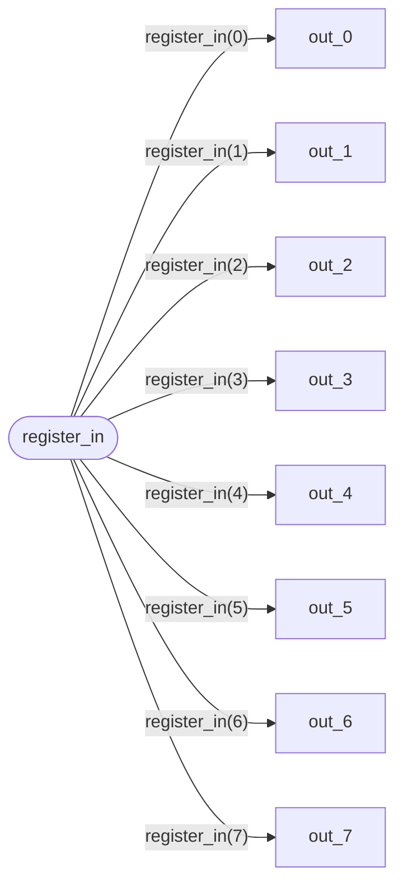

# Formal Verification Report: `split_8.v`

**Language:** Verilog  
**Source:** `split_8.v`

## Continuous Assignments

| Target | Expression |
|--------|------------|
| `out_0` | `register_in[0]` |
| `out_1` | `register_in[1]` |
| `out_2` | `register_in[2]` |
| `out_3` | `register_in[3]` |
| `out_4` | `register_in[4]` |
| `out_5` | `register_in[5]` |
| `out_6` | `register_in[6]` |
| `out_7` | `register_in[7]` |

## Issues

- 🔵 **INFO:** Combinatorial logic only (no clocked process)

## Dataflow Diagram



## Source Code

```verilog
assign out_0 = register_in[0];
assign out_1 = register_in[1];
assign out_2 = register_in[2];
assign out_3 = register_in[3];

assign out_4 = register_in[4];
assign out_5 = register_in[5];
assign out_6 = register_in[6];
assign out_7 = register_in[7];
```

---
*Generated by formal_verify.py*